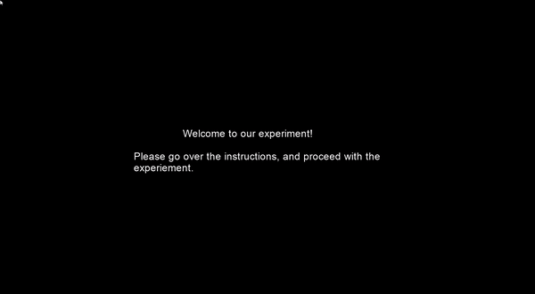

### Human Memory Recognition Task

#### Description:
In this experiment, six words are shown to the participant in the study phase. These words are either green, or red, in color. After studying these words, participants are asked to proceed with the test phase whenever ready. In test pase, participants are shown twelve words, six old words from the study phase, and six new words from test phase, mixed in a random manner. All the words in the test phase are uncolored. For each word, participant has to distinguish, and present with a response as to whether the word is old (from study phase), or new. 

#### How to use:
##### Run the task: 
 
Offline:

Online: 

Please clich [here](https://gitlab.pavlovia.org/infinitejest/human-recognition-memory-experiment) to run the experiment online at Pavlovia.org.

[Pavlovia - Human Recognition Memory Experiment](Pavlovia.jpg)

  

#### Credits:
- [PsychoPy Recognition Memory Experiment](https://www.youtube.com/watch?v=9BqRyut2UZk&list=PL-KTa_GY7VEMehFKqnBgIg48KqbKwSj-a)
- [Basic PsychoPy Data Processing in Excel - Part 1 & 2](https://www.youtube.com/watch?v=jl_0ZY0KFKw&list=PL-KTa_GY7VEMehFKqnBgIg48KqbKwSj-a&index=3)
- [Plotting PsychoPy Data in Excel](https://www.youtube.com/watch?v=yTtRCltfJg0&list=PL-KTa_GY7VEMehFKqnBgIg48KqbKwSj-a&index=5)
- [RKN and Confidence Rating Data Processing in Excel ](https://www.youtube.com/watch?v=NVZOx5d3vRE&list=PL-KTa_GY7VEMehFKqnBgIg48KqbKwSj-a&index=6)

